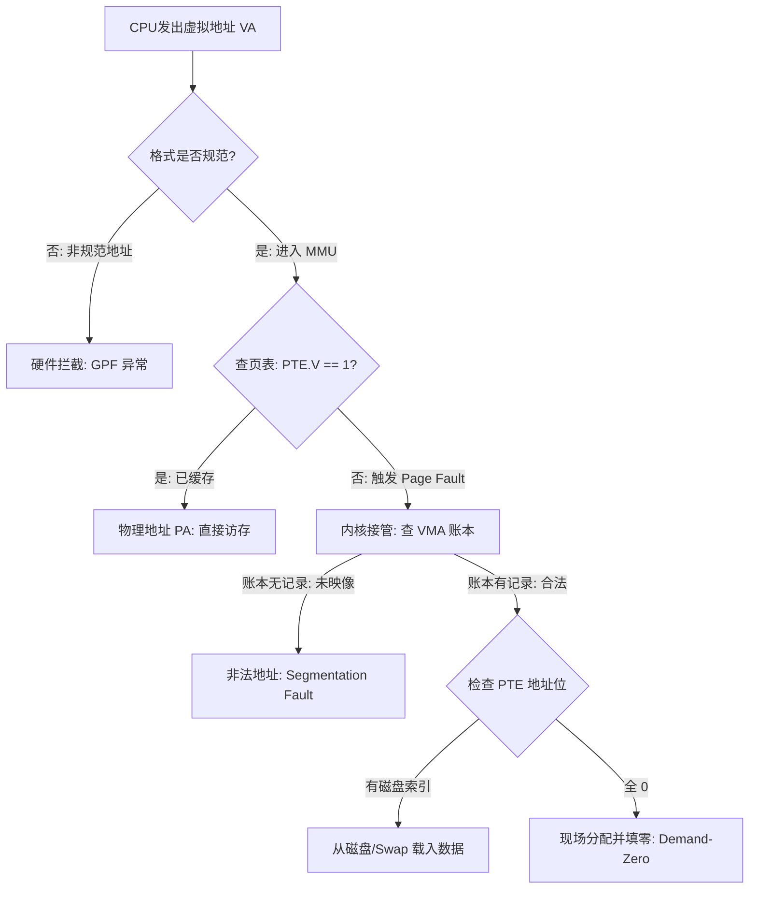

在现代操作系统中，虚拟地址空间是进程内存管理的核心概念。理解虚拟地址的不同状态及其处理流程，对于分析内存故障（如 Segment Fault）及优化性能至关重要。本文将从虚拟地址的分类、CPU 访存的执行流以及核心机制总结三个方面进行阐述。

## 一、 虚拟地址的分类图谱

根据虚拟地址在进程控制块（`mm_struct`）中的登记情况（VMA）以及硬件页表项（PTE）的状态，可将虚拟地址分为以下几类：

### 1. 合法的虚拟地址

此类地址已在进程的虚拟内存区域（VMA）链表/树中正式登记，来源于 `malloc` 分配、`mmap` 映射或程序段加载等操作。根据数据是否驻留物理内存，又细分为三种状态：

*   **已缓存**
    *   **硬件标志**：`PTE.V = 1`（页表项有效位为 1）。
    *   **物理位置**：物理内存（RAM）。
    *   **处理机制**：MMU 通过页表或 TLB 直接完成虚拟地址到物理地址的翻译，CPU 无需内核干预即可直接访问数据。

*   **未缓存 / 已换出**
    *   **硬件标志**：`PTE.V = 0`，但 `PTE.Addr` 指向磁盘/Swap 索引。
    *   **物理位置**：磁盘或交换分区。
    *   **处理机制**：访问时触发**缺页异常**。操作系统捕获该异常，启动磁盘 I/O 将数据从外部存储读取至物理内存，更新页表，随后恢复进程执行。

*   **待填零**
    *   **硬件标志**：`PTE.V = 0`，且 `PTE.Addr` 字段为全 0。
    *   **物理位置**：不在物理内存也不在磁盘，比如新分配的堆内存（`malloc`）或程序的 `.bss` 段。
    *   **处理机制**：首次访问时触发**缺页异常**。内核识别到该地址属于合法 VMA 且需填零，会分配一个物理页帧，将其内容清零后映射到虚拟地址，最后恢复进程执行。

### 2. 非法地址

此类地址虽然在 CPU 的硬件寻址范围内（例如 x86-64 的 48 位虚拟地址空间内），但并未在进程的 VMA 数据结构中登记。

*   **未映像地址**
    *   **状态描述**：属于硬件寻址范围，但未在 `mm_struct` 的 VMA 红黑树中找到对应记录。
    *   **处理机制**：MMU 翻译失败 -> 触发缺页异常陷入内核 -> 内核搜索 VMA 无果 -> 判定访问越界 -> 内核向进程发送 `SIGSEGV` 信号，通常导致进程终止。

### 3. 无效地址

此类地址违反了 CPU 架构规定的地址格式约束，由硬件直接拦截，通常不会进行复杂的页表查找。

*   **非规范地址**
    *   **状态描述**：地址位不符合 CPU 规范。以 x86-64 为例，目前仅使用低 48 位，要求第 48\~63 位必须进行符号扩展（即高位全为 0 或全为 1）。不满足此条件的地址即为非规范地址。
    *   **处理机制**：**硬件直接拦截**。CPU 抛出 General Protection Fault (#GP)，终止当前指令流，不查询页表，也不进入操作系统的缺页处理逻辑。

## 二、 CPU 访存的真实执行流

当 CPU 执行指令访问某个虚拟地址（VA）时，硬件与操作系统协作执行以下判定流程：

1.  **硬件层格式校验**
    *   CPU 首先检查地址是否符合架构规范（是否为 Canonical Address）。
    *   若地址非法（情况3：非规范地址），硬件直接抛出异常，流程终止。

2.  **MMU 地址翻译 (TLB/Page Table Walk)**
    *   若地址格式合法，MMU 查询 TLB 或遍历页表。
    *   **情况 A：`PTE.V == 1`**（已缓存）
        *   硬件直接获取物理地址（PA），访问目标内存单元。
    *   **情况 B：`PTE.V == 0`**（不在物理内存中，可能是未缓存/待填零/非法地址）
        *   硬件触发 **Page Fault** 异常，控制权移交给操作系统内核。

3.  **内核缺页异常处理程序**
    内核接管后，依据软件维护的数据结构进行进一步处理：
    *   **第一步：校验地址合法性（查 VMA）**
        *   内核检查该地址是否位于进程的某个 VMA 区域内。
        *   **若未找到对应 VMA**：判定为非法访问，内核向进程发送 `SIGSEGV` 信号。
    *   **第二步：处理缺页（查 PTE 内容）**
        *   **若 VMA 校验通过**：内核进一步检查页表项的辅助信息。
            *   如果 `PTE.Addr` 非零：说明数据在磁盘/Swap 区，PTE地址栏未数据所在磁盘中地址，内核调度 I/O 进行换入。
            *   如果 `PTE.Addr` 为零：说明是请求填零页，内核分配物理页并清零。

## 三、 总结

虚拟地址空间的完整处理流程体现了计算机系统中分层设计的思想：

*   **VMA（虚拟内存区域）**：定义了进程逻辑上的**合法地址范围**。它是软件层面的“权限管理器”，决定了地址访问是否属于逻辑错误（如段错误）。
*   **PTE（页表项）**：描述了页面的**物理存在状态**。它是硬件与软件交互的接口位，决定了数据当前位于物理内存还是磁盘中。
*   **地址翻译流程**：体现了软硬件协同机制。硬件（MMU）负责高速转换与格式校验，操作系统负责异常处理、数据加载及逻辑合法性校验。两者共同实现了内存的高效利用与进程间的隔离。

