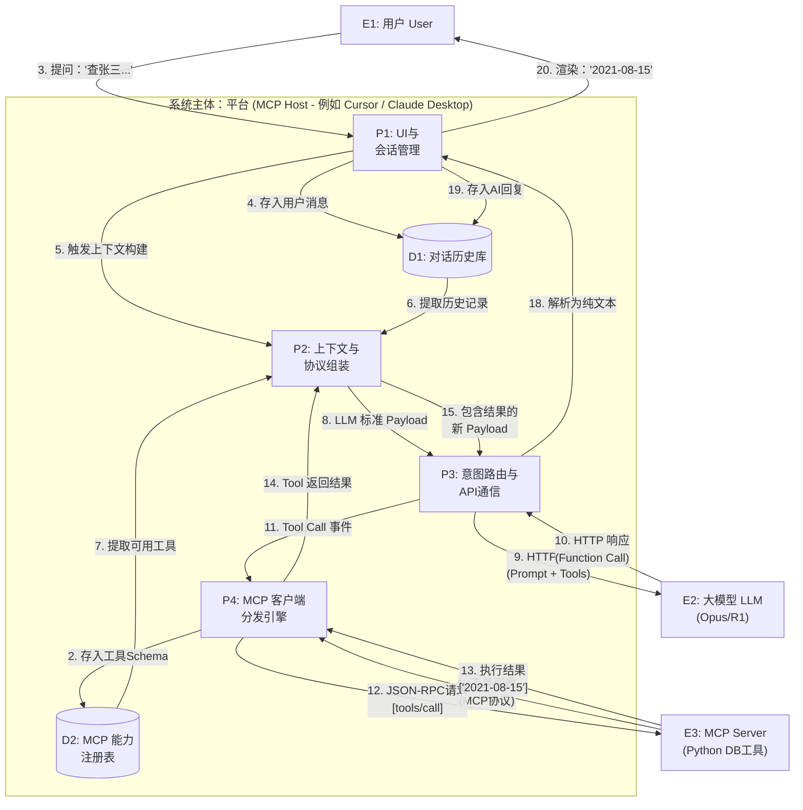

本文从 MCP 的定义出发，深入剖析其底层原理，并结合软件工程视角的实体架构与数据流图，通过“查询员工张三信息”的具体案例，来说明MCP背后的技术逻辑。

## 一、 什么是 MCP？为什么需要它？

### 1. MCP 的定义
MCP 是由 Anthropic 推出的一个**开源标准协议**，其起源于 2024 年 11 月 25 日 Anthropic 发布的文章：Introducing the Model Context Protocol。

MCP （Model Context Protocol，模型上下文协议）定义了AI模型和外部工具之间交换上下文信息的流程和方式。这使得开发者能够以一致的方式将各种数据源和工具连接到 AI 模型中，就像 USB-C 让不同设备能够通过相同的接口连接一样。MCP 的目标是创建一个通用标准，使 AI 应用程序的开发和集成变得更加简单和统一。

### 2. 为什么要使用 MCP？
在 MCP 出现之前，AI 领域面临着严重的“集成噩梦”。
*   **痛点（N × M 问题）：** 假设有 5 种主流 AI 和 10 种常用工具。若要让所有 AI 都能调用所有工具，开发者需要开发 `5 × 10 = 50` 种不同的插件。
*   **MCP 的解法（N + M 模式）：** 有了 MCP，工具开发者只需开发一个符合 MCP 标准的“服务端”，AI 应用只需支持“MCP 客户端”。工作量降至 `5 + 10 = 15`。实现了**“一次开发，处处可用”**。
*   **安全与隐私：** MCP 采用本地 Client-Server 架构。敏感数据和 账号密钥 保留在本地服务端，AI 厂商无法直接获取，仅需按需交换数据，极大提升了安全性。

## 二、 MCP 的核心原理

### 1. 架构模型：Client-Server
MCP 的核心是经典的客户端-服务端模型：
*   **MCP Host（宿主）：** 用户交互的应用（如 Claude Desktop）。
*   **MCP Client（客户端）：** 内置于宿主中，负责协议转换。
*   **MCP Server（服务端）：** 运行在本地的轻量级程序，负责对接真实的外部系统。

### 2. 三大核心能力
MCP Server 向外暴露三种核心能力：
1.  **Resources（资源）：** 提供数据读取能力（如文件内容、数据库 Schema）。
2.  **Tools（工具）：** 提供执行操作的能力（如执行 SQL、调用 API）。
3.  **Prompts（提示词）：** 预定义的模板，帮助 AI 更好地理解任务。

### 3. 与 Function Calling 的关系
**MCP 并没有取代 Function Calling（函数调用），而是将其标准化。**
*   **大模型层：** 依然使用各家模型原生的 Function Calling 格式（如 OpenAI 或 Anthropic 格式）。
*   **传输层：** MCP 定义了一套标准的 JSON-RPC 2.0 协议，用于在 Client 和 Server 之间传输这些调用指令。
*   **关键点：** 宿主应用充当了“翻译官”，将模型的原生指令翻译为 MCP 协议，反之亦然。这意味着**大模型厂商无需重新训练模型**，即可支持 MCP。

## 三、 软件工程视角：实体架构与数据流

为了更严谨地理解 MCP，我们从软件工程角度定义系统实体，并结合“查询员工张三”的案例进行剖析。

### 1. 实体
*   **User（用户）：** 需求的发起者。
*   **Platform / MCP Host（平台）：** 系统的**中央调度枢纽**（如 Claude Desktop）。内部包含 MCP Client，负责协议转换和路由。
*   **LLM（大模型）：** 系统的**大脑**（如 Opus, DeepSeek R1）。只认原生 Function Call，不知 MCP 为何物。
*   **MCP Server（服务端）：** 系统的**手和脚**（如 Python 写的本地查询服务）。遵循 MCP 协议，提供真实的工具和资源，并执行具体的工作任务。

### 2. L1 数据流图（DFD）
下图展示了在“查询张三”场景下，数据如何在各实体间流动。我们将“平台”作为系统边界。

### 3. 用例剖析

基于上述架构，我们以查询“张三”入职时间为例，推演数据流的完整生命周期：

#### 阶段一：初始化与注册（工具发现）
1.  **MCP Server** 启动，向 **Platform** 的 **P4 (MCP Client)** 发送自身的工具定义（如 `query_employee_db`）和资源定义（如数据库表结构）。
2.  **P4** 将这些信息解析并存入 **D2 (MCP 能力注册表)**。*注：此过程为本地通信，不消耗云端 Token。*

#### 阶段二：意图识别与决策（LLM 推理）
3.  **User** 输入：“帮我查一下研发部张三的入职时间”。
4.  **P1 (UI)** 接收输入，存入 **D1 (历史库)**，并转发给 **P2 (协议组装)**。
5.  **P2** 从 **D1** 提取历史，从 **D2** 提取工具列表，将其翻译成 **LLM** 原生的 API Payload（包含工具定义）。
6.  **P3 (API通信)** 将请求发送给 **LLM**。
7.  **LLM** 分析意图，决定调用工具，返回 Function Call 指令（JSON 格式）给 **P3**。

#### 阶段三：执行与返回（MCP 交互）
8.  **P3** 识别到工具调用指令，路由给 **P4**。
9.  **P4** 将指令转换为 MCP 协议的 JSON-RPC 格式，发送给 **MCP Server**。
10. **MCP Server** 执行本地 Python/SQL 代码，查询到结果“2021-08-15”，并通过 MCP 协议返回给 **P4**。

#### 阶段四：最终生成（回答用户）
11. **P4** 将结果传递给 **P2**。
12. **P2** 将结果封装为 Tool Message，再次通过 **P3** 发送给 **LLM**。
13. **LLM** 结合结果生成最终回答：“张三的入职时间是 2021年8月15日”。
14. **P3** 将文本返回 **P1**，展示给 **User**。

---

## 四、 深度思考：关于 MCP 的争议与误区

近期业界有观点认为 MCP 导致“上下文肥胖症”且存在“过度工程化”。结合工程原理，我们需要客观看待：

### 1. 关于“Token 消耗”的真相
*   **误区：** 认为 MCP 初始化加载工具消耗 50,000 Token。
*   **真相：** MCP 初始化发生在本地进程间通信，**不消耗 Token**。Token 的消耗在于 LLM 的**无状态特性**——每次请求都需要将挂载的工具定义全量发给云端。如果 MCP Server 定义了极其复杂的 Schema（如 100 张表结构），确实会推高单次对话成本。
*   **对策：** 未来的 MCP Host（平台）必须具备“动态工具路由”能力。比如先用一个小模型做意图识别，只把相关的 2~3 个 MCP 工具定义发给大模型，而不是一股脑把 100 个工具全塞进 Prompt 里。。

### 2. 关于“过度工程化” vs “封装 API”
*   **实效派观点：** 既然模型能写代码，直接给个 CLI 或 Markdown 文档（SKILL.md）不就行了？
*   **工程派观点（MCP 的价值）：**
    *   **安全性：** 直接暴露 CLI 给模型风险极高（如误删文件）。MCP Server 提供了权限沙箱。
    *   **标准化：** 企业级应用需要鉴权、审计、错误处理。MCP 将这些脏活封装在 Server 内部，对模型暴露统一接口，这才是企业级落地的正途。

## 总结与建议

如果你正在评估是否要为你的系统引入 MCP 架构，可以参考以下建议：

1.  **不要把所有东西都做成 MCP：**

    *   如果只是个人使用，或者一个一次性的脚本自动化任务，**别写 MCP**。直接给大模型提供 CLI 工具和一份 README.md，让它自己写脚本执行，效率最高。
2.  **以下场景，必须坚决使用 MCP：**

    *   你要把工具共享给**不懂代码的普通用户**（他们通过 Claude Desktop 点击鼠标就能接入你的服务）。
    *   工具涉及**核心数据库/资产操作**，必须在 MCP Server 层做严格的参数校验和权限拦截。
    *   你的系统需要接入**多个不同的 AI 平台**（不仅是 Claude，还有 Dify、Cursor、甚至未来的其他 Agent 平台），MCP 是目前唯一的跨平台标准。
3.  **未来的终极形态（混合模式）：** 未来的 AI 平台底层依然会使用 MCP 协议来保证标准和安全，但在识别到复杂和跨系统任务时，平台会自动把开发者写的简单 `SKILL.md` 或普通 Python 函数，**静默编译/包装**成 MCP 协议。 *即：开发者只管写业务逻辑，平台负责把业务逻辑变成符合 MCP 规范的架构。*

